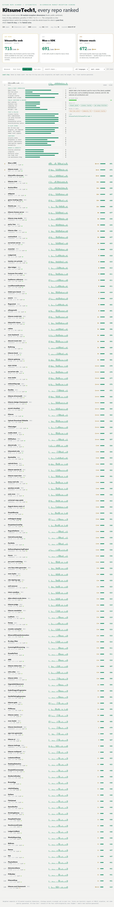

# kitsune-repo-scanner

Point it at a GitHub org or user and it grades **every repo** on a 30-category
**market-reception rubric**: how the public would actually receive the project if you
open-sourced it and posted it to Reddit or Hacker News. It writes each repo a one-line
description, scores it 0-1000 (F to S++++), flags **AI-slop risk**, and drops a savable
HTML scouting report you can sort and filter.

Built to answer one question fast: *of everything I've made, what's worth releasing, and
in what order do I post it?*



## What it measures

Not code quality. **Reception.** 30 categories in six groups (weights in parens):

| Group | What it asks |
|-------|--------------|
| Hook & first impression (25) | name, one-line pitch, visual proof, 5-second clarity, README top |
| Public sentiment & desire (25) | real problem, audience size, community fit, shareability, wow |
| Trust & polish (18) | license, docs, setup friction, freshness, presentation, security optics |
| **AI-slop signal (12)** | buzzword copy, template smell, wrapper-vs-depth, human craft |
| Substance (10) | actually works, uniqueness, completeness, code-quality signals, hackability |
| Growth & longevity (10) | virality, longevity, portfolio value, flame risk, maintenance drag |

Scores map to nonlinear letter bands (wide at the bottom, tight at the top; S-tier only
above 950 and gated behind every hook+sentiment axis at 9+). **AI-slop risk** is surfaced
as its own 0-100 headline: the inverse of the four craft/originality axes, so a high number
means it reads machine-generated.

## Usage

Needs the [`gh` CLI](https://cli.github.com/) authenticated (`gh auth status`) and Node 18+.

```bash
git clone https://github.com/KitsuneTech1/kitsune-repo-scanner
cd kitsune-repo-scanner

# grade every public repo in an org, open the report
node bin/kitsune-scan.mjs <org> --open

# include private repos, refine subjective axes + descriptions with an LLM
node bin/kitsune-scan.mjs <org> --include-private --ai --open
```

Flags:

| Flag | Effect |
|------|--------|
| `--ai` | LLM pass over the subjective categories + a cleaner description (needs `AZURE_FOUNDRY_KEY`) |
| `--include-private` | grade private repos too |
| `--out DIR` | output directory (default `./report`) |
| `--limit N` | cap repos scanned |
| `--open` | open the HTML report when done |

Output: `report/index.html` (the scouting report) and `report/report.json` (raw scores).

### AI refinement (optional)

Heuristics run with zero setup. To sharpen the subjective axes and descriptions, set an
Azure AI Foundry key and pass `--ai`:

```bash
export AZURE_FOUNDRY_KEY=...           # required for --ai
export AZURE_FOUNDRY_URL=...           # optional, defaults to the Foundry models path
export AI_MODEL=DeepSeek-V4-Pro        # optional
```

Any provider with an OpenAI-style `/chat/completions` works if you point `AZURE_FOUNDRY_URL`
at it. Without a key, `--ai` silently falls back to heuristics.

## MCP server

### What is an MCP server?

MCP (Model Context Protocol) is a standard way to give an AI agent new abilities. On
its own, an agent like Claude can read and write text but cannot reach out and do things.
An MCP server plugs in a set of tools the agent can call, each one a named action with
defined inputs, like a function. Once you connect this server, your agent can grade a
GitHub org, score a single repo, check a repo for leaked secrets before you make it
public, and rank repos by how well they would do on Reddit. You just ask in plain English,
for example "audit my repo before I open source it," and the agent picks the right tool
and runs it. You connect an MCP server once in your agent's settings and it stays available.

### This one

The scanner is also an MCP server, so an AI agent can grade repos, audit them for
leaked secrets, and pick what to post, all on demand. It speaks JSON-RPC over stdio
with no SDK dependency.

```bash
node mcp/server.mjs           # stdio JSON-RPC
```

### Tools

| Tool | What it does |
|---|---|
| `scan_org({ owner, includePrivate?, ai? })` | Grade every repo in an org/user. Ranked JSON with grades, post-scores, and hygiene flags. |
| `score_repo({ owner, name, ai? })` | Full 30-category breakdown for one repo. |
| `audit_repo({ owner, name })` | Security pass before open-sourcing: finds leaked credentials, API keys, private LAN IPs, committed `.env`/key files, and build junk. Returns a go/no-go verdict. |
| `best_to_post({ owner, top?, includePrivate? })` | Ranks repos by how well they would do on Reddit or HN. Public, OSS-safe only by default. |

### Register it

Claude Code:

```bash
claude mcp add repo-scanner -- node /absolute/path/to/kitsune-repo-scanner/mcp/server.mjs
```

Any MCP client (Cursor, Claude Desktop, etc.), in the `mcpServers` config:

```json
{
  "mcpServers": {
    "repo-scanner": {
      "command": "node",
      "args": ["/absolute/path/to/kitsune-repo-scanner/mcp/server.mjs"],
      "env": { "SCAN_PII": "your-lan-ip,your-handle,your-domain" }
    }
  }
}
```

Requirements: the `gh` CLI authenticated on the host. `SCAN_PII` (optional, comma-separated)
adds your own IPs/handles/domains to the exposure scan. Set `AZURE_FOUNDRY_KEY` to enable the
`ai: true` refinement pass.

## How scoring works

`src/rubric.mjs` defines the categories, weights, grade bands, and kill-switch caps.
`src/score.mjs` turns repo signals (description, README, images, license, topics, stars,
recency, tests, CI, disk size, AI-slop phrase hits) into deterministic 0-10 scores. The
optional AI pass overrides only the categories a machine can't read from signals alone.
Everything is explainable: expand any card to see all 30 bars and any caps that fired.

Scores are a lens, not a verdict. A 0-star internal repo can't show public sentiment yet,
so treat the ranking as "what to polish and post first," which is exactly what it's for.

## License

MIT.
